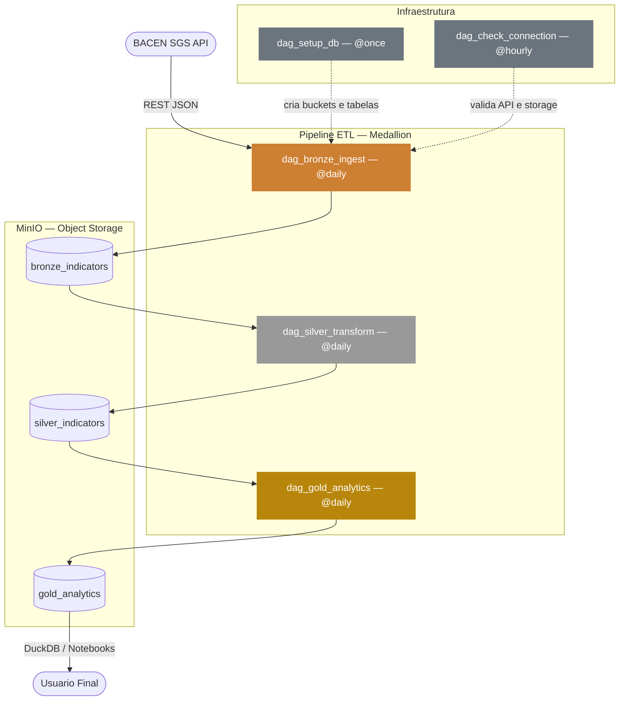

# 🏦 Brazilian Economic Indicators — Delta Lake Pipeline

Pipeline de dados **End-to-End** que extrai indicadores econômicos do **Banco Central do Brasil (BACEN)**, processa em camadas **Medallion** e armazena em um **Delta Lake local** utilizando **MinIO**.

---

## 🏗️ Arquitetura



---

## 🛠️ Stack Tecnológica

- **Orquestração:** Apache Airflow 2.7.1  
- **Armazenamento:** MinIO (S3-Compatible)  
- **Processamento:** Python (Pandas & Delta-rs)  
- **Infraestrutura:** Docker & Docker Compose  

---

## 📂 Estrutura do Repositório

Conforme organizado no ambiente de desenvolvimento:

```plaintext
├── dags/                      # Orquestração (Airflow)
│   ├── dag_bronze_ingest.py   # Extração API → Bronze
│   ├── dag_silver_transform.py# Transformação Bronze → Silver
│   ├── dag_gold_analytics.py  # Indicadores Silver → Gold
│   ├── dag_setup_db.py        # Inicialização de Buckets
│   ├── dag_check_connection.py # Validação de conectividade
│   └── lakehouse_dag.py       # DAG unificada do pipeline
│
├── src/                       # Lógica de Processamento (Core)
│   ├── api_client.py          # Cliente REST para o BACEN
│   ├── db_manager.py          # Conexão com MinIO/S3
│   ├── delta_manager.py       # Operações Delta Lake
│   ├── transform.py           # Limpeza e Padronização
│   └── analytics.py           # Cálculos de Juro Real e Médias
│
├── data/minio_data/           # Persistência física do MinIO
├── notebooks/                 # Exploração e Visualização
├── docker-compose.yml         # Configuração dos serviços
└── .env                       # Variáveis de ambiente
```

---

## 🚀 Como Executar

### 1️⃣ Inicialização

Suba a infraestrutura completa com um único comando:

```bash
docker compose up -d
```

O Airflow instalará automaticamente as dependências (`deltalake`, `pandas`, `boto3`) durante o boot.

---

### 2️⃣ Acesso

- **Airflow:** http://localhost:8080  
  - User: `admin`  
  - Senha:

```bash
docker exec -it airflow_app cat standalone_admin_password.txt
```

- **MinIO:** http://localhost:9001  
  - User: `admin`  
  - Pass: `password`  

---

### 3️⃣ Execução

Dispare as DAGs na ordem:

```
dag_setup_db ➔ lakehouse_dag
```

---

✨ **Projeto desenvolvido por Samuel Frizzone Cardoso – Ciência da Computação (UFLA).**
