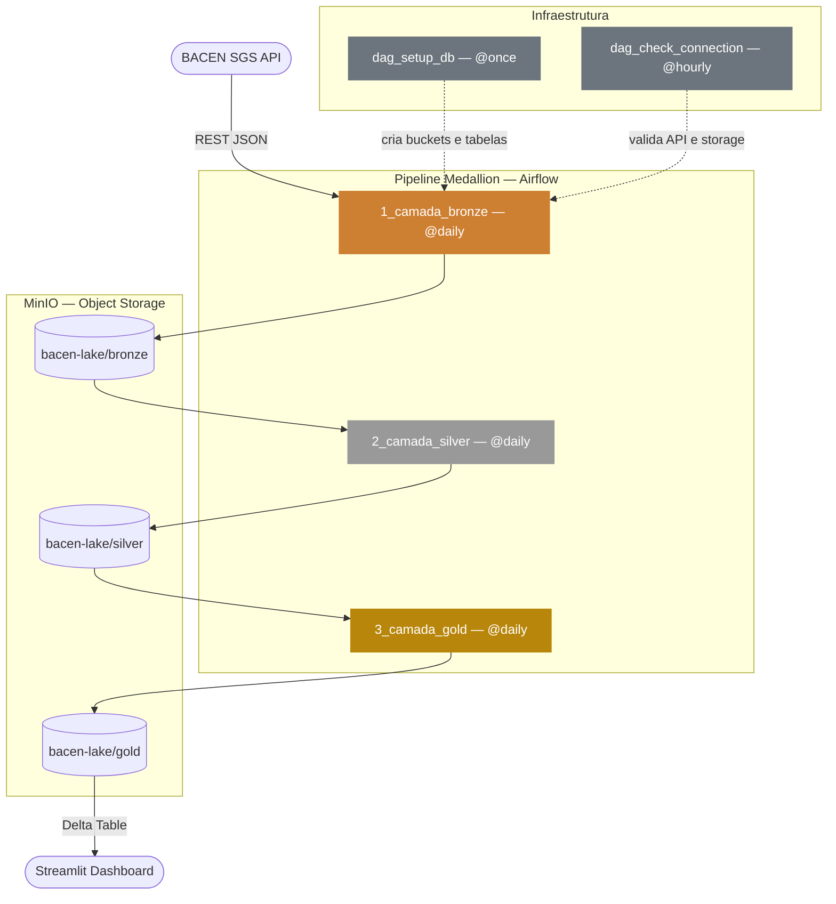

# 🏦 Brazilian Economic Indicators — Delta Lake Pipeline

Pipeline de dados **End-to-End** que extrai indicadores econômicos do Banco Central do Brasil (BACEN), processa através da arquitetura **Medallion** e armazena em um **Delta Lake local utilizando MinIO**.

---

## 🏗️ Arquitetura

O fluxo segue uma orquestração rígida onde a infraestrutura é validada antes do processamento dos dados.

### 📌 Diagrama do Fluxo



---

## 📂 Estrutura do Repositório

A organização do projeto separa a **orquestração (DAGs)** da **lógica de processamento (Módulos)**, facilitando a manutenção e testes isolados:

```plaintext
├── dags/                      # Orquestração (Airflow)
│   ├── dag_bronze_ingest.py   # Extração API → Bronze
│   ├── dag_silver_transform.py# Transformação Bronze → Silver
│   ├── dag_gold_analytics.py  # Indicadores Silver → Gold
│   ├── dag_setup_db.py        # Inicialização de infraestrutura
│   ├── dag_check_connection.py # Monitoramento de serviços
│   └── lakehouse_dag.py       # DAG unificada (brazilian_economic_lakehouse)
├── src/                       # Módulos Core (Injetados em /dags/src/)
│   ├── api_client.py          # Cliente REST para o BACEN
│   ├── db_manager.py          # Conexão S3/MinIO e gestão de buckets
│   ├── delta_manager.py       # Operações ACID com Delta Lake
│   ├── transform.py           # Limpeza e Padronização (Silver)
│   └── analytics.py           # Cálculos de Juro Real (Gold)
├── data/minio_data/           # Persistência física do Lake
├── notebooks/                 # Exploração e Visualização de dados
├── docker-compose.yml         # Configuração dos microsserviços
└── .env                       # Credenciais e Endpoints
```

---

## 🛠️ Stack Tecnológica

- **Orquestração:** Apache Airflow 2.7.1  
- **Storage:** MinIO (S3-Compatible Object Storage)  
- **Tabelas:** Delta Lake (via delta-rs) para transações ACID  
- **Processamento:** Python (Pandas & Boto3)  
- **Infraestrutura:** Docker & Docker Compose  

---

## 🚀 Como Executar

### 1️⃣ Inicialização

Suba a infraestrutura completa (Airflow, Postgres e MinIO):

```bash
docker compose up -d
```

> **Nota:** No primeiro boot, o Airflow instalará as dependências do `requirements.txt`.  
> Aguarde a mensagem **"Airflow is ready"** nos logs.

---

### 2️⃣ Acesso e Credenciais

- **Airflow:** http://localhost:8080  
  - User: `admin`  
  - Senha:
    ```bash
    docker exec -it airflow_app cat standalone_admin_password.txt
    ```

- **MinIO:** http://localhost:9001  
  - User: `admin`  
  - Pass: `password`

---

### 3️⃣ Execução do Fluxo

Ative e dispare a DAG:

```
brazilian_economic_lakehouse
```

Isso irá processar automaticamente todas as camadas (**Bronze → Silver → Gold**).

---

## ✨ Desenvolvido por

**Samuel Frizzone Cardoso**

